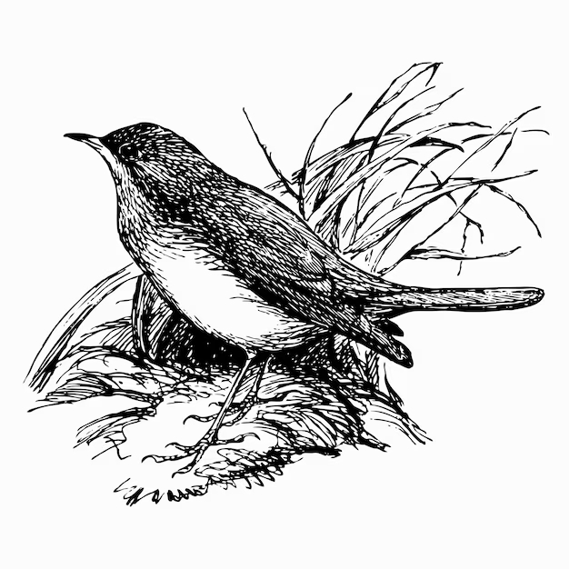

# Welcome to Rouxinol

<p align="center">
  
</p>

*The house wren (Troglodytes aedon) is a very small bird of the wren family, Troglodytidae. 
It occurs from Canada to South America, and is thus the most widely distributed native bird 
in the Americas. In Brazil, this small bird is popularly known as corruíra, corruíra, 
garrincha, cutipuruí, cambaxirra, carriça, garriça, carricinha, garricha or rouxinal.*

<br clear="left"/>

---
# **Table of Contents**

- [Introduction](#introduction)
- [Getting Started](#getting-started)
    - [Prerequisites](#prerequisites)
    - [Setup](#setup)
- [Structure](#structure)

<a id="introduction"></a>
# **Introduction**
Machine learning and code representations have contributed to the exploration of code generation, 
classification problems, and other problems. In this context, it repo describes **Rouxinol**, 
an infrastructure that provides developers with the means to explore this space.

<a id="getting-started"></a>
# **Getting Started**

<a id="prerequisites"></a>
### **Prerequisites**
You need the following packages.

- <a href="https://www.python.org/"> Python 3 </a>
- <a href="https://llvm.org/"> LLVM </a>
- <a href="https://github.com/rimsa/CFGgrind"> CFGgrind </a>
- <a href="https://github.com/tud-ccc/compy-learn"> Compy Learn </a>

<a id="setup"></a>
####  **Setup**
```bash
./install_deps.sh
```

<a id="structure"></a>
# **Structure**
The repository has the following organization.
```bash
|-- datasets "The datasets"
    |-- CodeNet.64c.300s*. "A small parte of the CodeNet Project."
    |-- Sample "A dataset for testing"
|-- docs "Rouxinol documentation"
|-- examples "How to use Rouxinol"
|-- rouxinol "The source code of Rouxinol"
    |-- environment "Compilation environments"
    |-- model "Machine learning models"
    |-- transformer "Code representations"
    |-- utilities "Some utilities"
```
