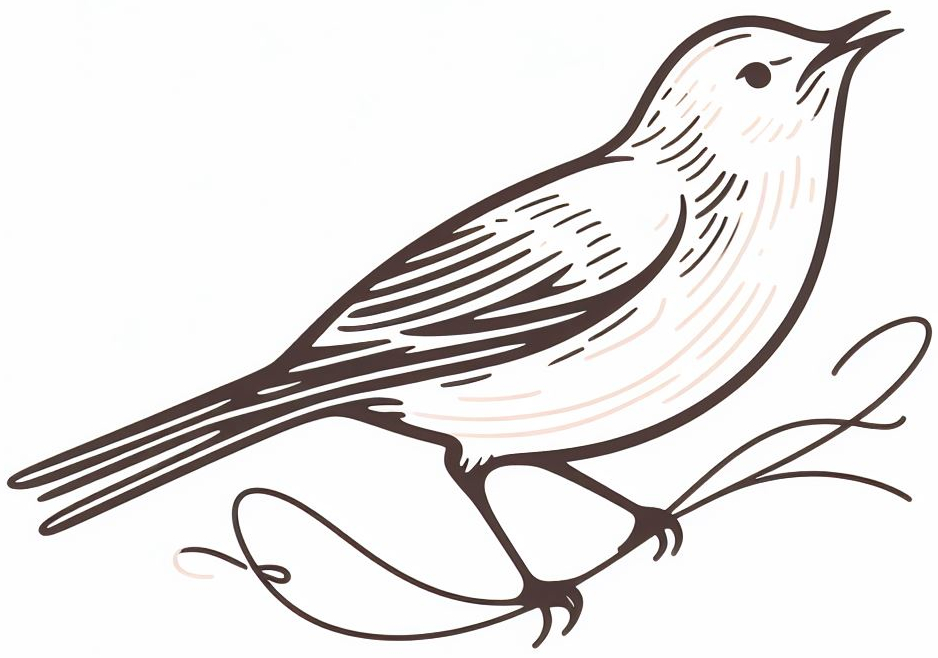

# Welcome to Rouxinol

<p align="center">
  
</p>

*The house wren (Troglodytes aedon) belongs to the wren family, Troglodytidae, and is a very small bird. 
Its habitat ranges from Canada to South America, making it the most extensively distributed native
bird throughout the Americas. In Brazil, this petite avian species is colloquially referred to as 
corruíra, corruíra, garrincha, cutipuruí, cambaxirra, carriça, garriça, carricinha, garricha, or rouxinal.*

<br clear="left"/>

---
# **Table of Contents**

- [Introduction](#introduction)
- [Getting Started](#getting-started)
    - [Setup](#setup)
    - [Examples](#examples)
    - [Artifacts](#artifacts)
- [Structure](#structure)

<a id="introduction"></a>
# **Introduction**

The application of machine learning has been instrumental in the progress of compilers. The efficacy of 
machine learning algorithms for compilers rely on the precision and expressiveness of code representation, 
which influences the model's learning capacity and performance. This repository introduces **Rouxinol**, 
providing developers with an infrastructure that enables exploration and innovation in this domain.

<a id="getting-started"></a>
# **Getting Started**

<a id="setup"></a>
####  **Setup**

1. Download and install Anaconda

2. Clone Rouxinol
```bash
git clone https://github.com/ComputerSystemsLaboratory/Rouxinol.git
```

3. Create a Rouxinol conda environment
```bash
cd Rouxinol
conda env create -f rouxinol.yml
```

4. Install the dependencies
```bash
./install.sh <CONDA TOP DIR> <NUMBER OF WORKERS> 
```

5. Install Rouxinol
```bash
conda activate rouxinol
./pip build .
```

<a id="examples"></a>
####  **Examples**

To learn how to use Rouxinol, refer to Rouxinol/examples.

<a id="artifacts"></a>
####  **Artifacts**

To learn how to replicate CC 2025 results, refer to Rouxinol/artifacts/CC_2025.

<a id="structure"></a>
# **Structure**

The repository has the following organization.
```bash
|-- artifacts "Paper artifacts"
|-- doc "Documentation"
|-- examples "How to use Rouxinol"
|-- passes "LLVM passes description"
|-- rouxinol "Source code"
    |-- dataset "Dataset description"
    |-- environment "Compilation environments"
    |-- learning "Machine Learning models"
    |-- third_party "Third party software"
    |-- transformer "Code representations"
    |-- utility "Utilities"
```

# **Publications**

Anderson Faustino da Silva, Jeronimo Castrillon, Fernando Magno Quintão Pereira, [A Comparative Study on the Accuracy and the Speed of Static and Dynamic Program Classifiers](https://dl.acm.org/doi/abs/10.1145/3708493.3712680), Proceedings of the 34th ACM SIGPLAN International Conference on Compiler Construction (CC 2025), Association for Computing Machinery, New York, NY, USA, Mar 2025.

Anderson Faustino da Silva, Hamid Farzaned, Joao Paulo Cardoso De Lima, Asif Ali Khan, Jeronimo Castrillon, [LearnCNM2Predict: Transfer Learning-based Performance Model for CNM Systems](), Proceedings of the 25st IEEE International Conference on Embedded Computer Systems: Architectures Modeling and Simulation (SAMOS XXV), Springer-Verlag, Berlin, Heidelberg, Jul 2025.
